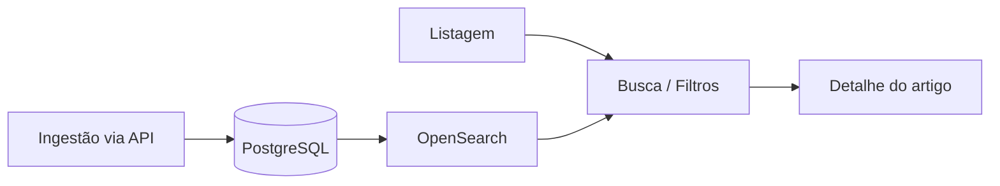
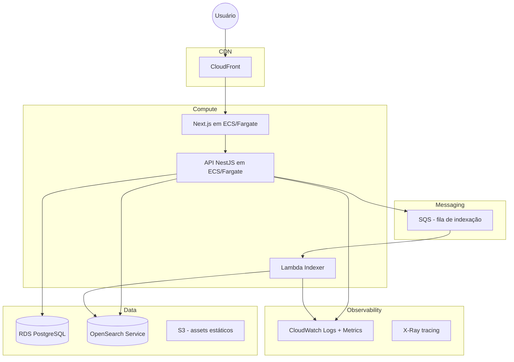

# Especificação Técnica — Portal de Notícias (SDD)

> **Spec Driven Development** — decisões de implementação registradas antes e durante o código.  
> Requisitos funcionais e não funcionais do desafio: [requisitos-funcionais-nao-funcionais.md](./requisitos-funcionais-nao-funcionais.md).

---

## 1. Rastreabilidade

Mapa entre requisitos do edital e implementação neste repositório (backend).

### 1.1 Requisitos funcionais

| Requisito | Status | Implementação |
|-----------|--------|---------------|
| [RF01](./requisitos-funcionais-nao-funcionais.md#rf01--listagem-de-artigos) | 🔜 | `GET /api/v1/articles` — PostgreSQL ou OpenSearch (com `q`) |
| [RF02](./requisitos-funcionais-nao-funcionais.md#rf02--paginação) | 🔜 | Query `page`, `limit`; resposta com `meta` |
| [RF03](./requisitos-funcionais-nao-funcionais.md#rf03--busca-textual) | 🔜 | OpenSearch quando `q` presente — [§4.1](#41-listagem) |
| [RF04](./requisitos-funcionais-nao-funcionais.md#rf04--filtro-por-categoria) | 🔜 | Query `category` |
| [RF05](./requisitos-funcionais-nao-funcionais.md#rf05--filtro-por-tag) | 🔜 | Query `tag` |
| [RF06](./requisitos-funcionais-nao-funcionais.md#rf06--visualização-do-artigo) | 🔜 | `GET /api/v1/articles/:slug` — [§4.2](#42-detalhe) |
| [RF07](./requisitos-funcionais-nao-funcionais.md#rf07--api-de-artigos) | 🔜 | Endpoints em [§4](#4-contratos-da-api) |
| [RF08](./requisitos-funcionais-nao-funcionais.md#rf08--ingestão-de-artigos) | 🔜 | `POST` / `PUT` + header `X-API-Key` — [§4.3](#43-ingestão-criar), [§4.4](#44-ingestão-atualizar) |
| [RF09](./requisitos-funcionais-nao-funcionais.md#rf09--persistência) | ✅ | PostgreSQL via Prisma — schema + migration — [§2](#2-modelo-de-dados) |
| [RF10](./requisitos-funcionais-nao-funcionais.md#rf10--dados-iniciais) | 🔜 | `prisma/seed.ts` |
| [RF11](./requisitos-funcionais-nao-funcionais.md#rf11--estados-da-interface) | — | Frontend (repositório separado) |

> **Extra (bootstrap):** `GET /api/v1/health` — ✅ implementado (não faz parte dos RF do edital).

### 1.2 Requisitos não funcionais

| Requisito | Status | Implementação neste repo |
|-----------|--------|--------------------------|
| [RNF01](./requisitos-funcionais-nao-funcionais.md#rnf01--typescript) | ✅ | TypeScript com `strict` no `tsconfig.json` |
| [RNF02](./requisitos-funcionais-nao-funcionais.md#rnf02--backend) | ✅ | NestJS 11 + adapter Fastify — [§3.1](#31-stack-escolhida) |
| [RNF03](./requisitos-funcionais-nao-funcionais.md#rnf03--separação-de-responsabilidades) | 🔜 | Camadas DDD definidas; módulo `articles` pendente — [arquitetura.md](./arquitetura.md) |
| [RNF04](./requisitos-funcionais-nao-funcionais.md#rnf04--tratamento-de-erros) | 🔜 | Formato em [§4.5](#45-erros-padronizados); filters pendentes |
| [RNF05](./requisitos-funcionais-nao-funcionais.md#rnf05--configuração-por-ambiente) | ✅ | `.env` + `@nestjs/config` |
| [RNF06](./requisitos-funcionais-nao-funcionais.md#rnf06--containerização) | ✅ | `docker-compose.yml` (PG, OpenSearch, LocalStack) |
| [RNF07](./requisitos-funcionais-nao-funcionais.md#rnf07--testabilidade) | 🔜 | Jest — a configurar |
| [RNF08](./requisitos-funcionais-nao-funcionais.md#rnf08--qualidade-de-código) | 🔜 | Padrões definidos em [arquitetura.md](./arquitetura.md); código pendente |
| [RNF09](./requisitos-funcionais-nao-funcionais.md#rnf09--escalabilidade) | 📄 | Arquitetura AWS — [§3.3](#33-arquitetura-proposta-para-produção-aws) |
| [RNF10](./requisitos-funcionais-nao-funcionais.md#rnf10--busca-e-persistência) | 🔜 | PG pronto; OpenSearch no Docker; integração na API pendente — [§3.2](#32-padrão-de-sincronização-banco--busca) |
| [RNF11](./requisitos-funcionais-nao-funcionais.md#rnf11--observabilidade) | 📄 | CloudWatch + X-Ray (produção) — [§3.3](#33-arquitetura-proposta-para-produção-aws) |
| [RNF12](./requisitos-funcionais-nao-funcionais.md#rnf12--segurança) | 🔜 | API Key + guards — pendentes no módulo `articles` |
| [RNF13](./requisitos-funcionais-nao-funcionais.md#rnf13--manutenibilidade) | 🔜 | Estrutura modular definida; repositórios pendentes |
| [RNF14](./requisitos-funcionais-nao-funcionais.md#rnf14--documentação) | ✅ | README, SDD, arquitetura, requisitos |
| [RNF15](./requisitos-funcionais-nao-funcionais.md#rnf15--spec-driven-development) | ✅ | Este documento |
| [RNF16](./requisitos-funcionais-nao-funcionais.md#rnf16--uso-responsável-de-ia) | 🔜 | A documentar no README antes da entrega |

Legenda: ✅ implementado · 🔜 planejado · 📄 só documentado · — fora deste repo

### 1.3 Fluxos principais



Correspondência com [RF01–RF08](./requisitos-funcionais-nao-funcionais.md#2-requisitos-funcionais): listagem (RF01/RF02), busca (RF03), filtros (RF04/RF05), detalhe (RF06), ingestão (RF08).

---

## 2. Modelo de dados

### 2.1 Entidade `Article`

```typescript
interface Article {
  id: string;           // UUID
  slug: string;         // URL-friendly, único
  title: string;
  summary: string;
  content: string;      // HTML ou Markdown
  publishedAt: string;  // ISO 8601
  author: string;
  category: string;     // ex: "Política", "Economia"
  tags: string[];       // ex: ["eleições", "paraná"]
  createdAt: string;
  updatedAt: string;
}
```

### 2.2 Banco relacional (PostgreSQL)

```
articles
├── id            UUID PK
├── slug          VARCHAR UNIQUE NOT NULL
├── title         VARCHAR NOT NULL
├── summary       TEXT NOT NULL
├── content       TEXT NOT NULL
├── published_at  TIMESTAMPTZ NOT NULL
├── author        VARCHAR NOT NULL
├── category      VARCHAR NOT NULL
├── tags          TEXT[] NOT NULL DEFAULT '{}'
├── created_at    TIMESTAMPTZ NOT NULL DEFAULT now()
└── updated_at    TIMESTAMPTZ NOT NULL DEFAULT now()
```

Índices: `slug`, `category`, `published_at DESC`. Índice GIN em `tags` é opcional e pode ser adicionado em migration futura.

ORM: **Prisma**. Migrations em `prisma/migrations/`.

### 2.3 Índice de busca (OpenSearch)

Índice: `articles`

```json
{
  "id": "uuid",
  "slug": "titulo-do-artigo",
  "title": "Título",
  "summary": "Resumo",
  "content": "Conteúdo completo",
  "publishedAt": "2026-01-15T10:00:00Z",
  "author": "Nome do autor",
  "category": "Política",
  "tags": ["tag1", "tag2"]
}
```

Campos com análise textual (`text`): `title`, `summary`, `content`, `tags`.  
Campos `keyword`: `category`, `slug`, `author`.

---

## 3. Decisões de arquitetura

### 3.1 Stack escolhida

| Camada | Tecnologia | Justificativa |
|--------|------------|---------------|
| Frontend | **Next.js 14+ (App Router)** + TypeScript | SSR/SSG para SEO; repositório separado |
| Backend | **NestJS 11** + **Fastify** + TypeScript | Módulos, DI, validação; Fastify como adapter HTTP ([RNF02](./requisitos-funcionais-nao-funcionais.md#rnf02--backend)) |
| ORM | **Prisma** | Migrations, type-safety, seed |
| Banco | **PostgreSQL** | Fonte de verdade relacional, ACID, arrays nativos para tags |
| Busca | **OpenSearch** | Full-text search, filtros, relevância |
| Infra local | **Docker Compose** | PostgreSQL, OpenSearch e LocalStack (SQS) |

### 3.2 Padrão de sincronização banco ↔ busca

**Local (a implementar no módulo `articles`):**

```
POST/PUT → ArticlesService → save(PG) → index(OpenSearch)
```

Orquestração **direta** no application service — sem Domain Events.

**Produção (documentado):**

```
POST/PUT → save(PG) → enqueue(SQS) → Lambda worker → index(OpenSearch)
```

Indexação **assíncrona** via SQS + Lambda, com Outbox para consistência eventual.

#### CQRS leve (leituras)

| Query | Fonte |
|-------|-------|
| Listagem e filtros (sem `q`) | PostgreSQL |
| Busca textual (`q`) | OpenSearch |
| Detalhe por slug | PostgreSQL |

Atende [RNF10](./requisitos-funcionais-nao-funcionais.md#rnf10--busca-e-persistência) e [RF03](./requisitos-funcionais-nao-funcionais.md#rf03--busca-textual).

### 3.3 Arquitetura proposta para produção (AWS)



| Componente | Serviço AWS | Motivo |
|------------|-------------|--------|
| Frontend | ECS Fargate ou Amplify | SSR contínuo; melhor que Lambda para Next.js com estado |
| API | ECS Fargate | Conexões persistentes com PG e OpenSearch; sem cold start |
| Banco | RDS PostgreSQL | Gerenciado, backups, Multi-AZ |
| Busca | OpenSearch Service | Gerenciado, escalável, integração nativa |
| Indexação | Lambda + SQS | Processamento assíncrono, escala sob demanda |
| CDN | CloudFront | Cache de páginas estáticas e assets |
| Observabilidade | CloudWatch + X-Ray | Logs centralizados, métricas, tracing distribuído |

Atende [RNF09](./requisitos-funcionais-nao-funcionais.md#rnf09--escalabilidade) e [RNF11](./requisitos-funcionais-nao-funcionais.md#rnf11--observabilidade).

### 3.4 Lambda vs Container (ECS/EC2) — trade-offs

| Critério | Lambda | ECS Fargate / EC2 |
|----------|--------|-------------------|
| Cold start | Presente | Ausente |
| Conexões DB | Pool limitado | Pool persistente |
| Custo em baixo tráfego | Menor | Maior (task sempre rodando) |
| Custo em alto tráfego | Pode escalar caro | Mais previsível |
| Complexidade | Menor | Maior (cluster, task defs) |

**Decisão:** API principal em **ECS Fargate**. **Lambda** apenas para workers de indexação.

### 3.5 Reindexação e remoção

| Operação | Fluxo |
|----------|-------|
| Criar | `INSERT` PG → index document no OpenSearch |
| Atualizar | `UPDATE` PG → update document (mesmo `id`) |
| Remover | `DELETE` PG → delete document por `id` |
| Reindexação total | Job batch lê todos os artigos do PG e faz bulk index no OpenSearch |

### 3.6 Estrutura do repositório

**Atual:**

```
portal-noticias-backend/
├── src/
│   ├── app.*                 # bootstrap + health-check
│   └── prisma/               # PrismaModule
├── prisma/
│   ├── schema.prisma
│   └── migrations/
├── docker/localstack/init/
├── docs/
├── docker-compose.yml
├── .env.example
└── README.md
```

**Alvo** (módulo `articles` + `shared/`): [arquitetura.md §3](./arquitetura.md#3-estrutura-de-pastas).

> Frontend (`portal-noticias-frontend`) em repositório separado.

Padrões de código e camadas: [arquitetura.md](./arquitetura.md).

---

## 4. Contratos da API

Base URL: `/api/v1`

### 4.1 Listagem

Atende [RF01](./requisitos-funcionais-nao-funcionais.md#rf01--listagem-de-artigos), [RF02](./requisitos-funcionais-nao-funcionais.md#rf02--paginação), [RF03](./requisitos-funcionais-nao-funcionais.md#rf03--busca-textual), [RF04](./requisitos-funcionais-nao-funcionais.md#rf04--filtro-por-categoria), [RF05](./requisitos-funcionais-nao-funcionais.md#rf05--filtro-por-tag).

```
GET /articles
```

**Query params**

| Param | Tipo | Descrição |
|-------|------|-----------|
| `q` | string | Termo de busca (opcional) |
| `category` | string | Filtro por categoria (opcional) |
| `tag` | string | Filtro por tag (opcional) |
| `page` | number | Página (default: 1) |
| `limit` | number | Itens por página (default: 10, max: 50) |

**Resposta 200**

```json
{
  "data": [ { /* Article resumido */ } ],
  "meta": {
    "page": 1,
    "limit": 10,
    "total": 24,
    "totalPages": 3
  }
}
```

> Com `q`: busca no OpenSearch. Sem `q`: consulta PostgreSQL.

**Meta de desempenho local:** < 500 ms (listagem/busca).

### 4.2 Detalhe

Atende [RF06](./requisitos-funcionais-nao-funcionais.md#rf06--visualização-do-artigo).

```
GET /articles/:slug
```

**Resposta 200** — objeto `Article` completo.  
**Resposta 404** — artigo não encontrado.

### 4.3 Ingestão (criar)

Atende [RF08](./requisitos-funcionais-nao-funcionais.md#rf08--ingestão-de-artigos).

```
POST /articles
Header: X-API-Key: <INGEST_API_KEY>
```

**Body**

```json
{
  "title": "string",
  "summary": "string",
  "content": "string",
  "publishedAt": "2026-01-15T10:00:00Z",
  "author": "string",
  "category": "string",
  "tags": ["string"]
}
```

**Resposta 201** — artigo criado e indexado.  
**Resposta 401** — chave inválida.  
**Resposta 422** — validação.

### 4.4 Ingestão (atualizar)

```
PUT /articles/:id
Header: X-API-Key: <INGEST_API_KEY>
```

**Body** — campos parciais ou completos.  
**Resposta 200** — artigo atualizado e reindexado.

### 4.5 Erros padronizados

Atende [RNF04](./requisitos-funcionais-nao-funcionais.md#rnf04--tratamento-de-erros).

```json
{
  "error": {
    "code": "ARTICLE_NOT_FOUND",
    "message": "Artigo não encontrado"
  }
}
```

---

## 5. Riscos, simplificações e próximos passos

### 5.1 Riscos

| Risco | Mitigação |
|-------|-----------|
| Dessincronia PG ↔ OpenSearch | Idempotência na indexação; job de reconciliação periódico |
| OpenSearch pesado localmente | Docker Compose com memória limitada; fallback `ILIKE` em dev |
| Slug duplicado | Geração automática a partir do título + sufixo numérico |

### 5.2 Simplificações assumidas

- Autenticação de ingestão via **API Key** (`X-API-Key`) — [RF08](./requisitos-funcionais-nao-funcionais.md#rf08--ingestão-de-artigos)
- Indexação **síncrona** em ambiente local
- Sem cache de consultas (Redis como próximo passo)
- Conteúdo em texto simples/Markdown

### 5.3 Fora do escopo

Ver [§4 do documento de requisitos](./requisitos-funcionais-nao-funcionais.md#4-fora-do-escopo).

### 5.4 Próximos passos

1. [x] Baseline de requisitos e especificação SDD
2. [x] Setup NestJS + Fastify + Prisma
3. [x] Docker Compose (PostgreSQL, OpenSearch, LocalStack)
4. [x] Migration inicial (`articles`)
5. [x] Health-check (`GET /api/v1/health`)
6. [x] README, `.env.example` e documentação de arquitetura
7. [ ] Módulo `articles` (endpoints RF01–RF08)
8. [ ] Seed com 20+ artigos ([RF10](./requisitos-funcionais-nao-funcionais.md#rf10--dados-iniciais))
9. [ ] Integração OpenSearch (busca e indexação)
10. [ ] Frontend Next.js ([RF11](./requisitos-funcionais-nao-funcionais.md#rf11--estados-da-interface))
11. [ ] (Opcional) Jest, CI, cache, ingestão assíncrona via SQS

Priorização completa: [§5 do documento de requisitos](./requisitos-funcionais-nao-funcionais.md#5-priorização).

---

*Versão: 1.1 — Agosto/2026*
