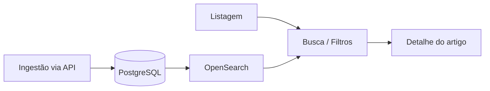
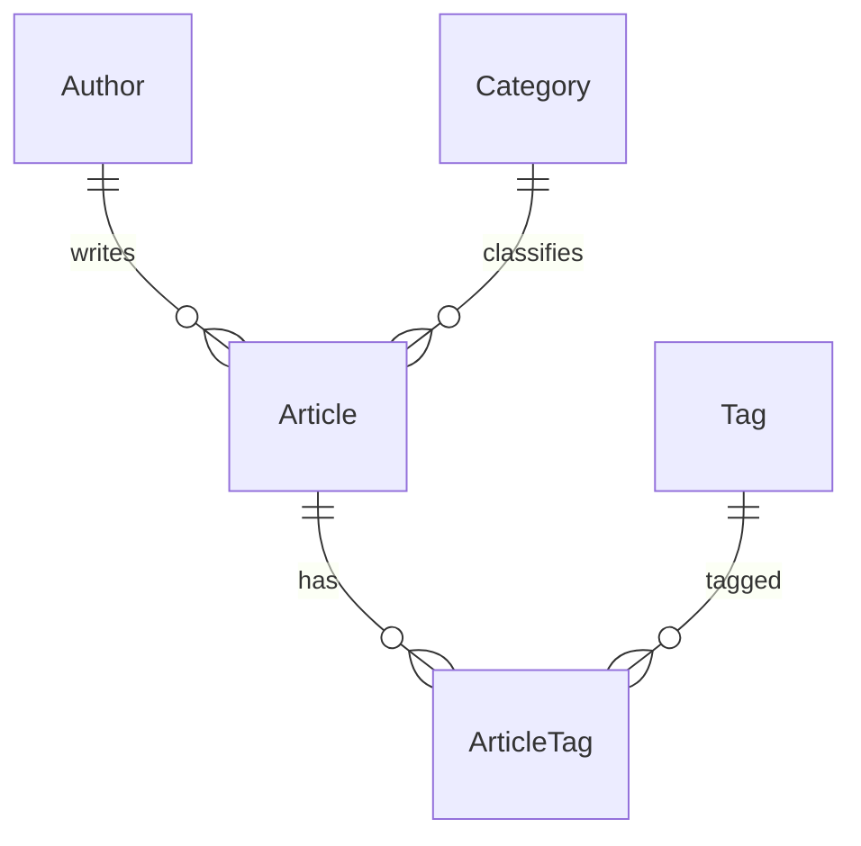
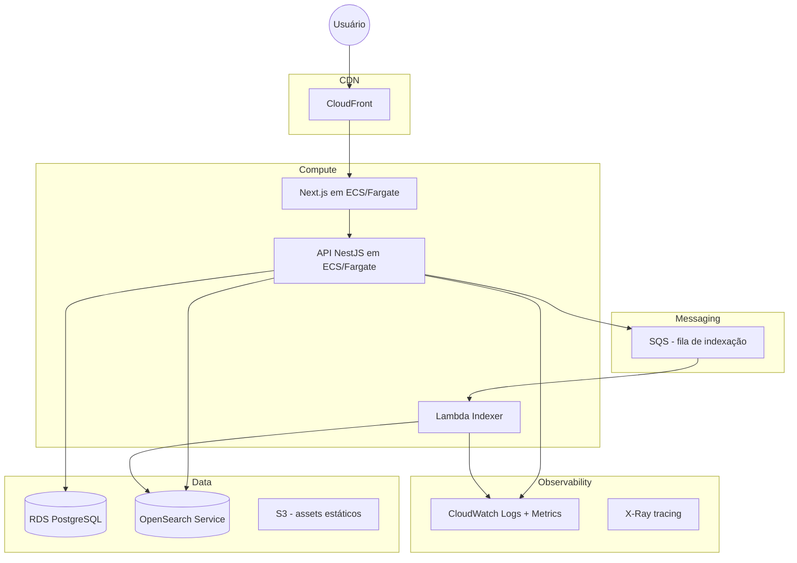

# Especificação Técnica — Portal de Notícias (SDD)

> **Spec Driven Development** — decisões de implementação registradas antes e durante o código.  
> Requisitos funcionais e não funcionais do desafio: [requisitos-funcionais-nao-funcionais.md](./requisitos-funcionais-nao-funcionais.md).

---

## 1. Rastreabilidade

Mapa entre requisitos do edital e implementação neste repositório (backend).

### 1.1 Requisitos funcionais

| Requisito | Status | Implementação |
|-----------|--------|---------------|
| [RF01](./requisitos-funcionais-nao-funcionais.md#rf01--listagem-de-artigos) | ✅ | `GET /api/v1/articles` — PostgreSQL (sem `q`); artigos publicados com título, resumo, data, autor, categoria, tags |
| [RF02](./requisitos-funcionais-nao-funcionais.md#rf02--paginação) | ✅ | Query `page`, `limit`; resposta com `meta` (`page`, `limit`, `total`, `totalPages`) |
| [RF03](./requisitos-funcionais-nao-funcionais.md#rf03--busca-textual) | ✅ | OpenSearch quando `q` presente — [§4.1](#41-listagem) |
| [RF04](./requisitos-funcionais-nao-funcionais.md#rf04--filtro-por-categoria) | ✅ | Query `category` — PG (sem `q`); OpenSearch (com `q`) — [§4.1](#41-listagem) |
| [RF05](./requisitos-funcionais-nao-funcionais.md#rf05--filtro-por-tag) | ✅ | Query `tag` — PG (sem `q`); OpenSearch (com `q`) — [§4.1](#41-listagem) |
| [RF06](./requisitos-funcionais-nao-funcionais.md#rf06--visualização-do-artigo) | ✅ | `GET /api/v1/articles/:slug` — [§4.2](#42-detalhe) |
| [RF07](./requisitos-funcionais-nao-funcionais.md#rf07--api-de-artigos) | ✅ | Endpoints em [§4](#4-contratos-da-api) |
| [RF08](./requisitos-funcionais-nao-funcionais.md#rf08--ingestão-de-artigos) | ✅ | `POST` / `PUT` + header `X-API-Key` — [§4.3](#43-ingestão-criar), [§4.4](#44-ingestão-atualizar) |
| [RF09](./requisitos-funcionais-nao-funcionais.md#rf09--persistência) | ✅ | PostgreSQL via Prisma — schema + migration — [§2](#2-modelo-de-dados) |
| [RF10](./requisitos-funcionais-nao-funcionais.md#rf10--dados-iniciais) | ✅ | `prisma/seed.ts` — 22 artigos, 5 categorias, 10 tags |
| [RF11](./requisitos-funcionais-nao-funcionais.md#rf11--estados-da-interface) | — | Frontend (repositório separado) |

> **Extra (bootstrap):** `GET /api/v1/health` — ✅ implementado (não faz parte dos RF do edital).

### 1.2 Requisitos não funcionais

| Requisito | Status | Implementação neste repo |
|-----------|--------|--------------------------|
| [RNF01](./requisitos-funcionais-nao-funcionais.md#rnf01--typescript) | ✅ | TypeScript com `strict` no `tsconfig.json` |
| [RNF02](./requisitos-funcionais-nao-funcionais.md#rnf02--backend) | ✅ | NestJS 11 + adapter Fastify — [§3.1](#31-stack-escolhida) |
| [RNF03](./requisitos-funcionais-nao-funcionais.md#rnf03--separação-de-responsabilidades) | ✅ | Camadas DDD no módulo `articles` — [arquitetura.md](./arquitetura.md) |
| [RNF04](./requisitos-funcionais-nao-funcionais.md#rnf04--tratamento-de-erros) | ✅ | Formato em [§4.5](#45-erros-padronizados); `DomainExceptionFilter` (`ARTICLE_NOT_FOUND`, `DUPLICATE_SLUG`) |
| [RNF05](./requisitos-funcionais-nao-funcionais.md#rnf05--configuração-por-ambiente) | ✅ | `.env` + `@nestjs/config` |
| [RNF06](./requisitos-funcionais-nao-funcionais.md#rnf06--containerização) | ✅ | `docker-compose.yml` (PG, OpenSearch, LocalStack) |
| [RNF07](./requisitos-funcionais-nao-funcionais.md#rnf07--testabilidade) | ✅ | Jest unitário + integração (domínio, service, HTTP, Prisma, OpenSearch) |
| [RNF08](./requisitos-funcionais-nao-funcionais.md#rnf08--qualidade-de-código) | ✅ | Padrões em [arquitetura.md](./arquitetura.md); módulo `articles` implementado |
| [RNF09](./requisitos-funcionais-nao-funcionais.md#rnf09--escalabilidade) | 📄 | Arquitetura AWS — [§3.3](#33-arquitetura-proposta-para-produção-aws) |
| [RNF10](./requisitos-funcionais-nao-funcionais.md#rnf10--busca-e-persistência) | ✅ | PG fonte de verdade; OpenSearch busca (`q`) e indexação síncrona na ingestão — [§3.2](#32-padrão-de-sincronização-banco--busca) |
| [RNF11](./requisitos-funcionais-nao-funcionais.md#rnf11--observabilidade) | 📄 | CloudWatch + X-Ray (produção) — [§3.3](#33-arquitetura-proposta-para-produção-aws) |
| [RNF12](./requisitos-funcionais-nao-funcionais.md#rnf12--segurança) | ✅ | `ApiKeyGuard` (`X-API-Key` / `INGEST_API_KEY`); validação de DTOs |
| [RNF13](./requisitos-funcionais-nao-funcionais.md#rnf13--manutenibilidade) | ✅ | Módulo `articles` com ports/adapters e repositórios Prisma |
| [RNF14](./requisitos-funcionais-nao-funcionais.md#rnf14--documentação) | ✅ | README, SDD, arquitetura, requisitos |
| [RNF15](./requisitos-funcionais-nao-funcionais.md#rnf15--spec-driven-development) | ✅ | Este documento |
| [RNF16](./requisitos-funcionais-nao-funcionais.md#rnf16--uso-responsável-de-ia) | ✅ | [uso-de-ia.md](./uso-de-ia.md) |

Legenda: ✅ implementado · 🔜 planejado · 📄 só documentado · — fora deste repo

### 1.3 Fluxos principais



Correspondência com [RF01–RF08](./requisitos-funcionais-nao-funcionais.md#2-requisitos-funcionais): listagem (RF01/RF02), busca (RF03), filtros (RF04/RF05), detalhe (RF06), ingestão (RF08).

---

## 2. Modelo de dados

### 2.1 Entidades de domínio

`Article` é o **aggregate root**. `Author`, `Category` e `Tag` são entidades de referência no mesmo bounded context.

```typescript
interface Article {
  id: string;           // UUID
  slug: string;         // URL-friendly, único
  title: string;
  summary: string;
  content: string;      // HTML ou Markdown
  publishedAt: string | null;  // ISO 8601; null = rascunho
  author: { id: string; name: string };
  category: { id: string; name: string; slug: string };
  tags: Array<{ id: string; name: string; slug: string }>;
  createdAt: string;
  updatedAt: string;
}
```

Na **API de leitura** (listagem e detalhe), `category` e `tags` são objetos `{ name, slug }`; `author` permanece string. Na **ingestão** (`POST`/`PUT`), `author`, `category` e `tags` continuam como strings; o backend faz find-or-create. A normalização relacional é interna ao backend.

### 2.2 Banco relacional (PostgreSQL)



```
authors
├── id            UUID PK
├── name          TEXT NOT NULL
├── created_at    TIMESTAMPTZ NOT NULL DEFAULT now()
└── updated_at    TIMESTAMPTZ NOT NULL DEFAULT now()

categories
├── id            UUID PK
├── name          TEXT NOT NULL
├── slug          TEXT UNIQUE NOT NULL
├── created_at    TIMESTAMPTZ NOT NULL DEFAULT now()
└── updated_at    TIMESTAMPTZ NOT NULL DEFAULT now()

tags
├── id            UUID PK
├── name          TEXT NOT NULL
├── slug          TEXT UNIQUE NOT NULL
├── created_at    TIMESTAMPTZ NOT NULL DEFAULT now()
└── updated_at    TIMESTAMPTZ NOT NULL DEFAULT now()

articles
├── id            UUID PK
├── title         TEXT NOT NULL
├── slug          TEXT UNIQUE NOT NULL
├── summary       TEXT NOT NULL
├── content       TEXT NOT NULL
├── published_at  TIMESTAMPTZ NULL
├── author_id     UUID FK → authors (ON DELETE RESTRICT)
├── category_id   UUID FK → categories (ON DELETE RESTRICT)
├── created_at    TIMESTAMPTZ NOT NULL DEFAULT now()
└── updated_at    TIMESTAMPTZ NOT NULL DEFAULT now()

article_tags
├── article_id    UUID FK → articles (ON DELETE CASCADE)
└── tag_id        UUID FK → tags (ON DELETE RESTRICT)
    PK (article_id, tag_id)
```

**Índices:**

| Tabela | Índices |
|--------|---------|
| `articles` | UNIQUE `slug`; INDEX `published_at DESC`; INDEX `author_id`; INDEX `(category_id, published_at DESC)` |
| `categories` | UNIQUE `slug` |
| `tags` | UNIQUE `slug` |
| `article_tags` | PK composta; INDEX `tag_id` |

**Regra de publicação (RF01):** listagem filtra `published_at IS NOT NULL AND published_at <= NOW()`.

ORM: **Prisma**. Migrations em `prisma/migrations/` (uma migration por entidade, em ordem de dependência). Seed em `prisma/seed.ts`.

| Migration | Entidade |
|-----------|----------|
| `20260820152537_create_authors` | `authors` |
| `20260820152538_create_categories` | `categories` |
| `20260820152539_create_tags` | `tags` |
| `20260820152540_create_articles` | `articles` (+ FKs para author/category) |
| `20260820152541_create_article_tags` | `article_tags` (+ FKs para article/tag) |

### 2.3 Índice de busca (OpenSearch)

Índice: `articles`

```json
{
  "id": "uuid",
  "slug": "titulo-do-artigo",
  "title": "Título",
  "summary": "Resumo",
  "content": "Conteúdo completo",
  "publishedAt": "2026-01-15T10:00:00Z",
  "author": "Nome do autor",
  "category": "tecnologia",
  "tags": ["inteligencia-artificial", "nextjs"]
}
```

> O documento OpenSearch é **denormalizado** (read model de busca). O `ArticleMapper.toSearchDocument()` achata as relações do PostgreSQL na indexação. Ver [ADR-0006](./adr/0006-modelo-relacional-normalizado.md).

Campos com análise textual (`text`): `title`, `summary`, `content`, `tags`.  
Campos `keyword`: `category`, `slug`, `author`.

---

## 3. Decisões de arquitetura

### 3.1 Stack escolhida

| Camada | Tecnologia | Justificativa |
|--------|------------|---------------|
| Frontend | **Next.js 14+ (App Router)** + TypeScript | SSR/SSG para SEO; repositório separado |
| Backend | **NestJS 11** + **Fastify** + TypeScript | Módulos, DI, validação; Fastify como adapter HTTP ([RNF02](./requisitos-funcionais-nao-funcionais.md#rnf02--backend)) |
| ORM | **Prisma** | Migrations, type-safety, seed |
| Banco | **PostgreSQL** | Fonte de verdade relacional, ACID, modelo normalizado com N:N para tags |
| Busca | **OpenSearch** | Full-text search, filtros, relevância |
| Infra local | **Docker Compose** | PostgreSQL, OpenSearch e LocalStack (SQS) |

### 3.2 Padrão de sincronização banco ↔ busca

**Local (implementado no módulo `articles`):**

```
POST/PUT → ArticlesService → save(PG) → index(OpenSearch)
```

Orquestração **direta** no application service — sem Domain Events.

**Produção (documentado):**

```
POST/PUT → save(PG) → enqueue(SQS) → Lambda worker → index(OpenSearch)
```

Indexação **assíncrona** via SQS + Lambda, com Outbox para consistência eventual.

#### CQRS leve (leituras)

| Query | Fonte |
|-------|-------|
| Listagem e filtros (sem `q`) | PostgreSQL |
| Busca textual (`q`) | OpenSearch |
| Detalhe por slug | PostgreSQL |

Atende [RNF10](./requisitos-funcionais-nao-funcionais.md#rnf10--busca-e-persistência) e [RF03](./requisitos-funcionais-nao-funcionais.md#rf03--busca-textual).

### 3.3 Arquitetura proposta para produção (AWS)



| Componente | Serviço AWS | Motivo |
|------------|-------------|--------|
| Frontend | ECS Fargate ou Amplify | SSR contínuo; melhor que Lambda para Next.js com estado |
| API | ECS Fargate | Conexões persistentes com PG e OpenSearch; sem cold start |
| Banco | RDS PostgreSQL | Gerenciado, backups, Multi-AZ |
| Busca | OpenSearch Service | Gerenciado, escalável, integração nativa |
| Indexação | Lambda + SQS | Processamento assíncrono, escala sob demanda |
| CDN | CloudFront | Cache de páginas estáticas e assets |
| Observabilidade | CloudWatch + X-Ray | Logs centralizados, métricas, tracing distribuído |

Atende [RNF09](./requisitos-funcionais-nao-funcionais.md#rnf09--escalabilidade) e [RNF11](./requisitos-funcionais-nao-funcionais.md#rnf11--observabilidade).

### 3.4 Lambda vs Container (ECS/EC2) — trade-offs

| Critério | Lambda | ECS Fargate / EC2 |
|----------|--------|-------------------|
| Cold start | Presente | Ausente |
| Conexões DB | Pool limitado | Pool persistente |
| Custo em baixo tráfego | Menor | Maior (task sempre rodando) |
| Custo em alto tráfego | Pode escalar caro | Mais previsível |
| Complexidade | Menor | Maior (cluster, task defs) |

**Decisão:** API principal em **ECS Fargate**. **Lambda** apenas para workers de indexação.

### 3.5 Reindexação e remoção

| Operação | Fluxo |
|----------|-------|
| Criar | `INSERT` PG → index document no OpenSearch |
| Atualizar | `UPDATE` PG → update document (mesmo `id`) |
| Remover | `DELETE` PG → delete document por `id` |
| Reindexação total | Job batch lê todos os artigos do PG e faz bulk index no OpenSearch |

### 3.6 Estrutura do repositório

**Atual:**

```
portal-noticias-backend/
├── src/
│   ├── app.*                 # bootstrap + health-check
│   └── prisma/               # PrismaModule
├── prisma/
│   ├── schema.prisma
│   └── migrations/
├── docker/localstack/init/
├── docs/
├── docker-compose.yml
├── .env.example
└── README.md
```

**Alvo** (módulo `articles` + `shared/`): [arquitetura.md §3](./arquitetura.md#3-estrutura-de-pastas).

> Frontend (`portal-noticias-frontend`) em repositório separado.

Padrões de código e camadas: [arquitetura.md](./arquitetura.md).

---

## 4. Contratos da API

Base URL: `/api/v1`

### 4.1 Listagem

Atende [RF01](./requisitos-funcionais-nao-funcionais.md#rf01--listagem-de-artigos), [RF02](./requisitos-funcionais-nao-funcionais.md#rf02--paginação), [RF03](./requisitos-funcionais-nao-funcionais.md#rf03--busca-textual), [RF04](./requisitos-funcionais-nao-funcionais.md#rf04--filtro-por-categoria), [RF05](./requisitos-funcionais-nao-funcionais.md#rf05--filtro-por-tag).

```
GET /articles
```

**Query params**

| Param | Tipo | Descrição |
|-------|------|-----------|
| `q` | string | Termo de busca (opcional) |
| `category` | string | Filtro por categoria (opcional) |
| `tag` | string | Filtro por tag (opcional) |
| `page` | number | Página (default: 1) |
| `limit` | number | Itens por página (default: 10, max: 50) |

**Resposta 200**

```json
{
  "data": [
    {
      "slug": "titulo-do-artigo",
      "title": "string",
      "summary": "string",
      "publishedAt": "2026-01-15T10:00:00.000Z",
      "author": "string",
      "category": { "name": "Política", "slug": "politica" },
      "tags": [{ "name": "Eleições", "slug": "eleicoes" }]
    }
  ],
  "meta": {
    "page": 1,
    "limit": 10,
    "total": 24,
    "totalPages": 3
  }
}
```

Filtros `category` e `tag` aceitam **slug** (ex.: `politica`, `eleicoes`).

> Com `q`: busca no OpenSearch. Sem `q`: consulta PostgreSQL.

**Meta de desempenho local:** < 500 ms (listagem/busca).

### 4.2 Detalhe

Atende [RF06](./requisitos-funcionais-nao-funcionais.md#rf06--visualização-do-artigo).

```
GET /articles/:slug
```

**Resposta 200** — objeto `Article` completo.  
**Resposta 404** — artigo não encontrado.

### 4.3 Catálogo de categorias

```
GET /categories
```

**Resposta 200** — array de `{ name, slug }` ordenado por `name`.

### 4.4 Catálogo de tags

```
GET /tags
```

**Resposta 200** — array de `{ name, slug }` ordenado por `name`.

### 4.5 Ingestão (criar)

Atende [RF08](./requisitos-funcionais-nao-funcionais.md#rf08--ingestão-de-artigos).

```
POST /articles
Header: X-API-Key: <INGEST_API_KEY>
```

**Body**

```json
{
  "title": "string",
  "summary": "string",
  "content": "string",
  "publishedAt": "2026-01-15T10:00:00Z",
  "author": "string",
  "category": "string",
  "tags": ["string"]
}
```

**Resposta 201** — artigo criado e indexado (inclui `id` e `publishedAt` nullable).  
**Resposta 401** — chave inválida.  
**Resposta 400** — validação (`ValidationPipe`, alinhado aos GETs).

`publishedAt` é opcional (omitido = rascunho). `author`, `category` e `tags` são strings; o backend faz find-or-create. O slug é gerado do título, com sufixo numérico se já existir.

### 4.6 Ingestão (atualizar)

```
PUT /articles/:id
Header: X-API-Key: <INGEST_API_KEY>
```

**Body** — campos parciais ou completos (`publishedAt: null` despublica). O slug **não** muda.  
**Resposta 200** — artigo atualizado e reindexado.  
**Resposta 401** — chave inválida.  
**Resposta 400** — validação ou UUID inválido.  
**Resposta 404** — artigo não encontrado.

### 4.7 Erros padronizados

Atende [RNF04](./requisitos-funcionais-nao-funcionais.md#rnf04--tratamento-de-erros).

```json
{
  "error": {
    "code": "ARTICLE_NOT_FOUND",
    "message": "Artigo não encontrado"
  }
}
```

Códigos: `ARTICLE_NOT_FOUND` (404), `DUPLICATE_SLUG` (409, corrida rara na unique do slug).

---

## 5. Riscos, simplificações e próximos passos

### 5.1 Riscos

| Risco | Mitigação |
|-------|-----------|
| Dessincronia PG ↔ OpenSearch | Idempotência na indexação; job de reconciliação periódico |
| OpenSearch pesado localmente | Docker Compose com memória limitada; fallback `ILIKE` em dev |
| Slug duplicado | Geração automática a partir do título + sufixo numérico |

### 5.2 Simplificações assumidas

- Autenticação de ingestão via **API Key** (`X-API-Key`) — [RF08](./requisitos-funcionais-nao-funcionais.md#rf08--ingestão-de-artigos)
- Indexação **síncrona** em ambiente local
- Sem cache de consultas (Redis como próximo passo)
- Conteúdo em texto simples/Markdown

### 5.3 Fora do escopo

Ver [§4 do documento de requisitos](./requisitos-funcionais-nao-funcionais.md#4-fora-do-escopo).

### 5.4 Próximos passos

1. [x] Baseline de requisitos e especificação SDD
2. [x] Setup NestJS + Fastify + Prisma
3. [x] Docker Compose (PostgreSQL, OpenSearch, LocalStack)
4. [x] Migration inicial (modelo relacional: authors, categories, tags, articles, article_tags)
5. [x] Health-check (`GET /api/v1/health`)
6. [x] README, `.env.example` e documentação de arquitetura
7. [x] Domínio + persistência do módulo `articles` (entidades, repositórios Prisma, seed)
8. [x] Endpoints RF08 (ingestão); RF01–RF06 ✅
9. [x] Integração OpenSearch — busca textual (RF03) ✅; indexação na ingestão (RF08) ✅
10. [ ] Frontend Next.js ([RF11](./requisitos-funcionais-nao-funcionais.md#rf11--estados-da-interface))
11. [x] Jest (testes de domínio e mappers)
12. [x] CI (GitHub Actions — lint, format, testes unitários, build, integração)
    [ ] cache de aplicação (diferencial); [ ] ingestão assíncrona via SQS

Priorização completa: [§5 do documento de requisitos](./requisitos-funcionais-nao-funcionais.md#5-priorização).

---

*Versão: 1.1 — Agosto/2026*
