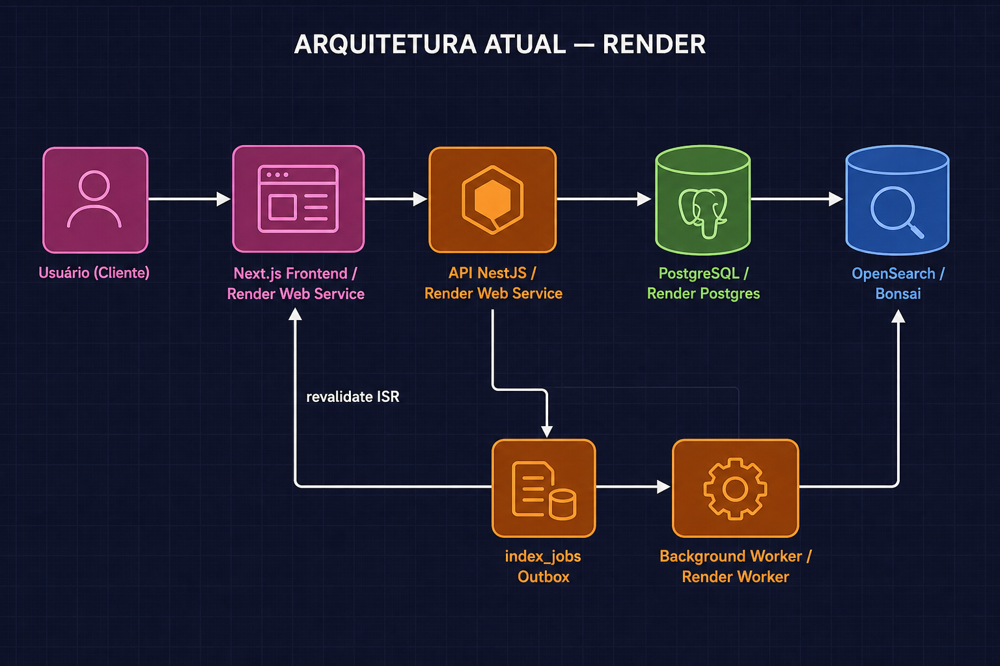
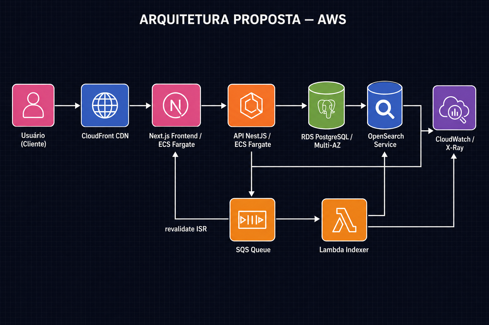
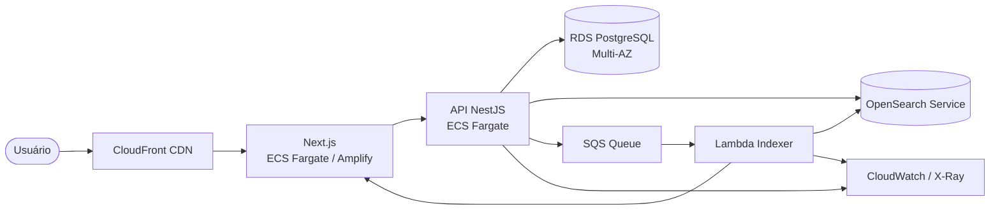

# Arquitetura de Produção — Portal de Notícias

> Cobre todos os pontos do edital sobre arquitetura proposta para produção: AWS, Lambda vs ECS, banco de dados, estratégia de indexação, observabilidade, segurança, escalabilidade e custo.
>
> Complementa o [SDD](./SDD.md) e o [README](../README.md).

---

## 1. Arquitetura atual (Render)

Deploy operacional em produção simplificada no **Render**. A API roda neste repositório; o frontend em [repositório separado](https://github.com/Lucas-Braz7x/portal-noticias-frontend).



| Serviço Render | Tipo | Comando | Repositório | Papel |
|----------------|------|---------|-------------|-------|
| `portal-noticias-frontend` | Web Service | `yarn start` | [portal-noticias-frontend](https://github.com/Lucas-Braz7x/portal-noticias-frontend) | Next.js SSR / ISR |
| `portal-noticias-api` | Web Service | `yarn start:prod` | [portal-noticias-backend](https://github.com/Lucas-Braz7x/portal-noticias-backend) | API NestJS REST |
| `portal-noticias-indexer` | Background Worker | `yarn start:worker` | [portal-noticias-backend](https://github.com/Lucas-Braz7x/portal-noticias-backend) | Consome `index_jobs`, indexa no OpenSearch |

**Fluxo de ingestão assíncrona (Render):**

```
POST/PUT → API salva no PG + insere index_jobs → 202 Accepted
Background Worker → poll index_jobs → index/remove OpenSearch → revalidate ISR frontend
```

**OpenSearch:** serviço externo (Bonsai ou AWS OpenSearch Service) — não roda no Render.

---

## 2. Arquitetura proposta para produção (AWS)





| Componente | Serviço AWS | Justificativa |
|------------|-------------|---------------|
| CDN | **CloudFront** | Cache de páginas e assets; HTTPS; anycast global |
| Frontend | **ECS Fargate** ou **Amplify** | SSR contínuo; melhor que Lambda para Next.js com estado e conexões persistentes |
| API | **ECS Fargate** | Conexões persistentes com PG e OpenSearch; sem cold start; pool de conexões estável |
| Banco | **RDS PostgreSQL (Multi-AZ)** | ACID, backups automáticos, failover gerenciado |
| Busca | **OpenSearch Service** | Cluster gerenciado, escalável, snapshots automáticos |
| Indexação | **Lambda + SQS** | Processamento assíncrono event-driven; escala zero a N por demanda |
| Observabilidade | **CloudWatch + X-Ray** | Logs centralizados, métricas, tracing distribuído |
| Segredos | **Secrets Manager / SSM** | Rotação automática; sem credenciais em código |

---

## 3. Por que AWS?

| Necessidade | Serviço AWS | Alternativa descartada |
|-------------|-------------|------------------------|
| Banco relacional gerenciado | RDS PostgreSQL | EC2 auto-gerenciado (operacional caro) |
| Busca textual escalável | OpenSearch Service | OpenSearch no ECS (operacional caro, sem HA) |
| Filas de mensagens | SQS | RabbitMQ/Kafka (over-engineering para o volume) |
| Workers event-driven | Lambda | Container sempre ativo (custo maior em baixo tráfego) |
| CDN global | CloudFront | Sem CDN (latência e custos de egress) |
| Observabilidade nativa | CloudWatch + X-Ray | Stack terceirizada (Datadog, Grafana) — custo extra |

A AWS fornece uma plataforma integrada onde todos os serviços se comunicam via IAM roles, sem necessidade de gerenciar credenciais entre componentes.

---

## 4. Lambda vs Container (ECS/EC2) — trade-offs

| Critério | Lambda | ECS Fargate / EC2 |
|----------|--------|-------------------|
| **Cold start** | Presente (100ms–2s) | Ausente (processo sempre ativo) |
| **Conexões com banco** | Pool limitado; RDS Proxy recomendado | Pool persistente, eficiente |
| **Custo em baixo tráfego** | Menor (paga por invocação) | Maior (task sempre rodando) |
| **Custo em alto tráfego** | Pode escalar caro sem limite | Mais previsível; auto-scaling por métrica |
| **Duração máxima** | 15 minutos | Ilimitado |
| **Estado** | Stateless | Pode manter estado em memória |
| **Deploy** | ZIP ou container image | Container image (ECR) |
| **Complexidade operacional** | Menor | Maior (cluster, task defs, ALB) |

**Decisão arquitetural:**

- **API NestJS → ECS Fargate**: a API mantém pool de conexões com PostgreSQL e OpenSearch. Cold start de Lambda causaria latência nas primeiras requisições e exigiria RDS Proxy para gerenciar conexões. ECS Fargate é mais adequado.

- **Worker de indexação → Lambda**: o worker é stateless, event-driven (acionado pela SQS), e tem execuções curtas (indexar 1–5 artigos por invocação). Lambda escala para zero automaticamente quando não há artigos para indexar — custo ideal.

- **Frontend Next.js → ECS Fargate ou Amplify**: SSR requer processo persistente; Lambda pode funcionar mas tem limitações de tamanho de bundle e cold start perceptível para SSR de páginas complexas.

---

## 5. Banco de dados e mecanismo de busca

### 5.1 Por que PostgreSQL?

- **Fonte de verdade relacional**: dados normalizados com integridade referencial (FKs, constraints ACID).
- **Modelo N:N para tags** (`article_tags`): evita duplicação e permite filtros RF04/RF05 eficientes.
- **`published_at` nullable**: rascunhos sem data de publicação — lógica simples sem coluna extra de status.
- **Filtros e paginação**: índice composto `(category_id, published_at DESC)` para listagem sem OpenSearch.
- **RDS PostgreSQL no AWS**: backups automáticos, Multi-AZ para HA, sem operação de servidor.

### 5.2 Por que OpenSearch?

- **Busca textual com relevância** (RF03): `multi_match` em `title`, `summary`, `content`, `tags` com scoring TF-IDF.
- **Filtros combinados** (RF04/RF05): filtros por `category` e `tags` dentro da busca textual — impossível com ILIKE no PG sem degradação de performance.
- **Denormalização proposital**: o documento OpenSearch é um read model achatado — sem JOINs na busca.
- **Fallback**: quando `OPENSEARCH_ENABLED=false`, a busca `q` cai no PostgreSQL via `ILIKE` (sem ranking, cobre dev sem Docker).

### 5.3 Relacionamento PG ↔ OpenSearch

```
PostgreSQL (fonte de verdade)
    ↓ ArticleMapper.toSearchDocument()
OpenSearch (read model de busca)

Listagem sem q  → PostgreSQL  (RF01/RF02/RF04/RF05)
Busca com q     → OpenSearch  (RF03)
Detalhe por slug → PostgreSQL  (RF06 — dado canônico)
```

O `id` do artigo é a chave de idempotência entre os dois stores — atualizar o documento no OpenSearch usa o mesmo `id` da linha no PG.

---

## 6. Estratégia de indexação

### 6.1 Fluxo por operação

| Operação | PG | OpenSearch | Quando |
|----------|----|------------|--------|
| **Criar artigo publicado** | INSERT | PUT `/articles/{id}` (index) | `publishedAt != null` |
| **Criar rascunho** | INSERT | — | `publishedAt == null` |
| **Atualizar → continua publicado** | UPDATE | PUT `/articles/{id}` (upsert) | Conteúdo ou metadados mudaram |
| **Publicar rascunho** | UPDATE `publishedAt` | PUT `/articles/{id}` (index) | Primeiro `publishedAt` |
| **Despublicar** | UPDATE `publishedAt = null` | DELETE `/articles/{id}` | `publishedAt` vai a null |
| **Reindexação total** | SELECT todos publicados | Bulk PUT | Bootstrap / recuperação |

### 6.2 Consistência eventual

A estratégia de Outbox (`index_jobs`) garante que **nenhum artigo persistido seja perdido na fila**:

```
ArticlesService
  → save(PG) em transação
  → INSERT index_jobs em transação (mesmo TX ou TX separada atômica)
  → HTTP 202

IndexWorkerService
  → SELECT ... FOR UPDATE SKIP LOCKED  (concorrência segura)
  → status = PROCESSING
  → search.index() ou search.remove()
  → status = COMPLETED
  → FrontendCacheInvalidationService.invalidate()
```

Jobs `FAILED` ficam com `status = FAILED` e `last_error` preenchido. Um job de reconciliação periódico pode reprocessar falhas.

### 6.3 Reindexação total

Cenários que exigem reindexação completa:
- Mudança no mapeamento do índice (ex.: novo campo analisado)
- Divergência detectada entre PG e OpenSearch (ex.: crash durante bulk indexing)
- Primeiro deploy em ambiente novo

Fluxo:
1. `SEARCH_REINDEX_ON_STARTUP=true` (dev): `ArticlesSearchBootstrap.onModuleInit()` busca todos os artigos publicados no PG e faz bulk index.
2. Produção: `SEARCH_REINDEX_ON_STARTUP=false`; rodar script avulso ou job agendado (`yarn reindex`).

---

## 7. Plano de observabilidade

### 7.1 Logs

| Camada | Ferramenta | O que logar |
|--------|------------|-------------|
| API NestJS | CloudWatch Logs (via `@nestjs/common` Logger) | Requests, erros, tempo de resposta |
| Worker | CloudWatch Logs | Jobs processados, falhas, tempo por job |
| Lambda | CloudWatch Logs (automático) | Invocações, duração, erros |
| RDS | CloudWatch Logs (slow query, error) | Queries lentas (>500ms) |
| OpenSearch | CloudWatch Logs | Erros de indexação, cluster health |

Formato recomendado: **JSON estruturado** com `timestamp`, `level`, `correlationId`, `service`, `message`, `meta`.

### 7.2 Métricas

| Métrica | Fonte | Alerta |
|---------|-------|--------|
| Latência P95 das rotas | ALB + CloudWatch | > 1s |
| Taxa de erro 5xx | ALB + CloudWatch | > 1% em 5 min |
| CPU/Memória das tasks | ECS CloudWatch | > 80% |
| Fila SQS (`ApproximateNumberOfMessagesVisible`) | SQS CloudWatch | > 1000 mensagens |
| Falhas Lambda | Lambda CloudWatch | > 0 em 5 min |
| Cluster health OpenSearch | OpenSearch CloudWatch | status != GREEN |
| Conexões ativas no RDS | RDS CloudWatch | > 80% do max |

### 7.3 Tracing

**AWS X-Ray** instrumenta automaticamente ECS Fargate e Lambda:
- Traço end-to-end: request HTTP → API → PG → SQS → Lambda → OpenSearch
- Identifica gargalos e erros em cada segmento
- `correlationId` propagado via header `X-Correlation-ID` entre serviços

### 7.4 Alertas e dashboards

- **Dashboard CloudWatch**: latência, throughput, error rate, fila SQS, OpenSearch health
- **Alarmes SNS**: notificações por e-mail/Slack para alertas críticos
- **AWS Health Dashboard**: eventos de serviço que afetam RDS, OpenSearch, ECS

---

## 8. Segurança, escalabilidade, custo e manutenção

### 8.1 Segurança

| Ponto | Implementação |
|-------|---------------|
| **Autenticação de ingestão** | `X-API-Key` header (`ApiKeyGuard`); chave em Secrets Manager |
| **Validação de entrada** | `ValidationPipe` (class-validator) em todos os DTOs; UUID validado por `ParseUUIDPipe` |
| **Segredos** | Nunca em código; variáveis de ambiente locais, Secrets Manager em produção |
| **Rede** | API e banco em VPC privada; apenas ALB exposto; grupos de segurança restritivos |
| **HTTPS** | CloudFront + ACM (certificado gerenciado); HSTS |
| **Erros sem exposição interna** | `DomainExceptionFilter` retorna só `code` e `message`; sem stack trace em produção |
| **Rate limiting** | WAF no CloudFront (a implementar); rate limit por IP na ingestão |
| **CORS** | Backend sem CORS (todo fetch é server-side); apenas o webhook de revalidação é S2S |

### 8.2 Escalabilidade

| Camada | Estratégia |
|--------|------------|
| **API (ECS)** | Auto-scaling por CPU/mem ou requisições/target no ALB; mínimo 2 tasks para HA |
| **Worker (Lambda)** | Escala automática por mensagens na fila SQS; concorrência reservada para evitar sobrecarga no OpenSearch |
| **PostgreSQL (RDS)** | Réplicas de leitura para queries analíticas; Multi-AZ para HA; connection pooling via PgBouncer ou RDS Proxy |
| **OpenSearch** | Multi-AZ deployment; sharding automático; réplicas de shard para leitura |
| **CloudFront** | Cache de borda global; `stale-while-revalidate` para resiliência |
| **Frontend (ECS/Amplify)** | ISR reduz carga na API; auto-scaling das tasks SSR |

### 8.3 Custo

| Componente | Otimização |
|------------|------------|
| **Lambda** | Execução zero-cost quando não há artigos para indexar |
| **RDS** | Reserved instances para carga previsível (-40% vs on-demand) |
| **OpenSearch** | Instâncias `t3` para volumes pequenos; UltraWarm para dados antigos |
| **CloudFront** | Cache alto (`Cache-Control: max-age=60`) reduz requisições ao origin |
| **ECS** | Spot instances para tasks não críticas (worker); Fargate Spot (-70% vs on-demand) |
| **Logs** | Retenção configurada (30d dev, 90d prod); exportar para S3 Glacier para histórico |

### 8.4 Manutenção

| Ponto | Prática |
|-------|---------|
| **Migrations** | `prisma migrate deploy` no pipeline de CI/CD antes do deploy da nova task |
| **Rollback** | Migrations retrocompatíveis (expand-contract pattern); versão anterior ainda funciona durante deploy |
| **Deploys zero-downtime** | ECS rolling update; CloudFront redireciona para tasks saudáveis |
| **Reindexação sem downtime** | Alias de índice no OpenSearch; indexar no índice novo, trocar alias atomicamente |
| **Dependências** | Dependabot para atualizações de segurança; testes unitários + integração no CI bloqueiam merge |

---

## 9. O que foi simulado vs implementado

| Funcionalidade | Status | Implementação real | Em produção real |
|----------------|--------|-------------------|-----------------|
| **Fila de indexação** | ✅ Implementado (Outbox PG) | Tabela `index_jobs` + Background Worker | SQS + Lambda |
| **Busca textual** | ✅ Implementado | OpenSearch local (Docker) / Bonsai (Render) | OpenSearch Service (AWS) |
| **Cache** | ✅ Implementado | `Cache-Control` HTTP + ISR + webhook revalidate | + Redis (ElastiCache) para cache partilhado |
| **Observabilidade** | 📄 Documentado | Logs básicos NestJS | CloudWatch + X-Ray |
| **CDN** | 📄 Documentado | Render inclui CDN básico | CloudFront |
| **Autenticação** | 📄 Parcial | API Key simples | Cognito / Auth0 / JWT completo |
| **Rate limiting** | 📄 Documentado | — | WAF + throttling no ALB |
| **Segredos gerenciados** | 📄 Documentado | `.env` local | Secrets Manager / SSM |
| **Multi-AZ / HA** | 📄 Documentado | Docker local / Render basic | RDS Multi-AZ + ECS 2 tasks |
| **SQS real** | 📄 Simulado | LocalStack SQS no Docker Compose | SQS gerenciado AWS |

> **Motivo das simulações:** o edital define como fora do escopo a implementação completa de infraestrutura AWS em produção. O Outbox PG + Render Worker entrega o **mesmo comportamento observável** (publicação rápida, indexação assíncrona) sem custo operacional de conta AWS para o desafio.

---

## 10. Referências

- [SDD — Especificação técnica](./SDD.md)
- [Arquitetura — Padrões de código](./arquitetura.md)
- [Deploy no Render](./deploy-render.md)
- [Próximos passos](./proximos-passos.md)
- [ADRs — Decisões arquiteturais](./adr/)

---

*Versão: 1.0 — Agosto/2026*
