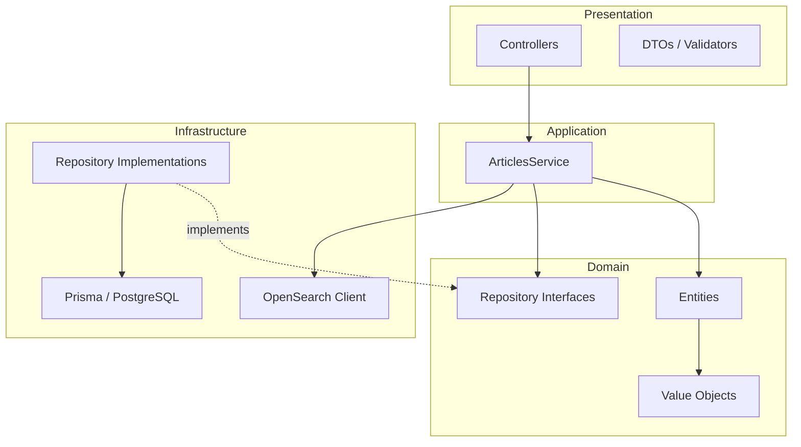
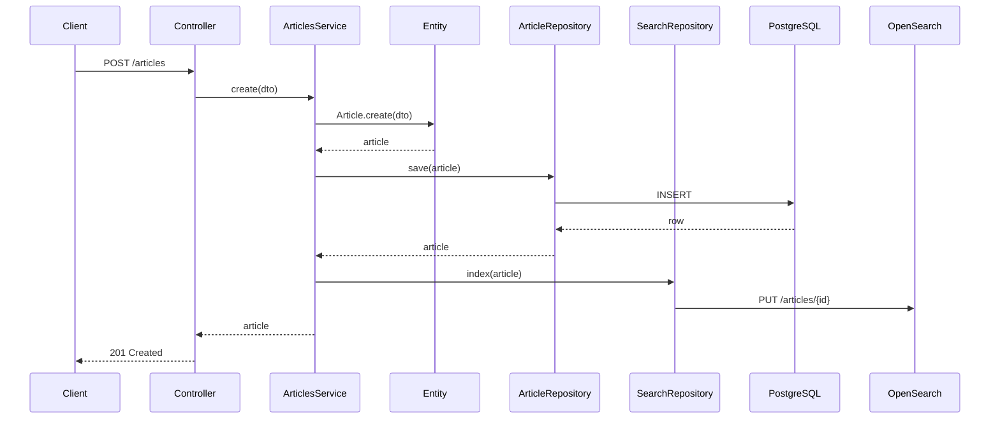

# Arquitetura — Portal de Notícias Backend

> Guia de decisões arquiteturais, padrões e convenções do projeto.  
> Complementa o [SDD](./SDD.md) e a [baseline de requisitos](./requisitos-funcionais-nao-funcionais.md).

---

## 1. Visão geral

A API segue **Domain-Driven Design (DDD) pragmático** com influências de **Arquitetura Hexagonal (Ports & Adapters)**, organizando o código em camadas com dependências apontando sempre para o domínio.



### Princípios adotados

| Princípio | Aplicação |
|-----------|-----------|
| **DDD pragmático** | Bounded context `articles`; entidades e value objects onde agregam valor |
| **Clean Code** | Funções pequenas, nomes expressivos, SRP, baixo acoplamento |
| **TDD** | Red → Green → Refactor; testes antes da implementação |
| **Repository** | Abstração de persistência no domínio; implementação na infraestrutura |
| **Services** | `ArticlesService` orquestra fluxos; regras de negócio ficam nas entidades |
| **CQRS leve** | Leituras distintas por fonte: PG para listagem/detalhe, OpenSearch para busca textual |

### O que implementar vs documentar

| Padrão | Decisão | Status atual |
|--------|---------|--------------|
| Repository + Services | **Implementar** no módulo `articles` | 🔜 Parcial (domínio + repos Prisma ✅; service/controller 🔜) |
| CQRS leve | **Implementar** (PG listagem / OpenSearch `q`) | ✅ Busca (`q`) + filtros `category`/`tag` (RF04/RF05) |
| Domain Events | **Não adotar** | ✅ Decisão fechada |
| Outbox + SQS | **Documentar (prod)**; LocalStack pronto no Docker | 📄 Infra local ✅ / código 🔜 |
| ADR | **Adotado** | ✅ `docs/adr/` |
| Testcontainers, Idempotency | **Documentar ou adiar** | 📄 Adiado |

---

## 2. Camadas e responsabilidades

### 2.1 Presentation (entrada HTTP)

- Controllers NestJS — apenas roteamento, validação de entrada e mapeamento de resposta.
- DTOs com `class-validator` — contratos de entrada/saída da API.
- Guards, Filters e Interceptors — autenticação, tratamento de erros, logging.

**Regra:** controllers **não** acessam Prisma ou OpenSearch diretamente.

### 2.2 Application (orquestração)

- **`ArticlesService`** — único application service que orquestra os fluxos (criar, atualizar, listar, buscar, detalhe).
- Coordena repositórios de persistência e busca de forma **direta**, sem event bus ou domain events.
- Não contém regras de negócio complexas — delegam ao domínio.

**Regra:** não criar use case separado por endpoint; um service bem estruturado é suficiente para o escopo.

### 2.3 Domain (núcleo)

- **Entities** — `Article` com identidade, factory method e validações.
- **Value Objects** — `Slug` (imutável, validado na criação).
- **Repository Interfaces** — contratos (`IArticleRepository`, `ISearchRepository`).
- **Domain Exceptions** — `ArticleNotFoundException`, `DuplicateSlugException`.

**Regra:** o domínio **não** depende de NestJS, Prisma ou OpenSearch.

### 2.4 Infrastructure (detalhes técnicos)

- Implementações concretas dos repositórios (`PrismaArticleRepository`, `OpenSearchSearchRepository`).
- Mappers entre modelos de persistência e entidades de domínio.
- Clientes externos (Prisma, OpenSearch SDK).

---

## 3. Estrutura de pastas

> **Alvo** do módulo `articles`. Domínio e persistência implementados; presentation/application pendentes.

```
src/
├── main.ts
├── app.module.ts
├── app.controller.ts          # health-check (temporário na raiz)
├── app.service.ts
│
├── modules/
│   └── articles/
│       ├── articles.module.ts              # 🔜 pendente
│       │
│       ├── presentation/                   # 🔜 pendente
│       │   ├── articles.controller.ts
│       │   └── dto/
│       │       ├── create-article.dto.ts
│       │       ├── update-article.dto.ts
│       │       └── list-articles-query.dto.ts
│       │
│       ├── application/                    # 🔜 pendente
│       │   └── articles.service.ts
│       │
│       ├── domain/                         # ✅ implementado
│       │   ├── entities/
│       │   │   ├── article.entity.ts       # aggregate root
│       │   │   ├── author.entity.ts
│       │   │   ├── category.entity.ts
│       │   │   └── tag.entity.ts
│       │   ├── value-objects/
│       │   │   └── slug.vo.ts
│       │   ├── repositories/
│       │   │   ├── article.repository.ts
│       │   │   ├── author.repository.ts
│       │   │   ├── category.repository.ts
│       │   │   ├── tag.repository.ts
│       │   │   └── search.repository.ts
│       │   └── exceptions/
│       │       ├── article-not-found.exception.ts
│       │       └── duplicate-slug.exception.ts
│       │
│       └── infrastructure/                 # ✅ parcial (Prisma ✅; OpenSearch ✅ busca / 🔜 ingestão)
│           ├── repositories/
│           │   ├── prisma-article.repository.ts
│           │   ├── prisma-author.repository.ts
│           │   ├── prisma-category.repository.ts
│           │   ├── prisma-tag.repository.ts
│           │   └── opensearch-search.repository.ts  # 🔜
│           └── mappers/
│               ├── article.mapper.ts
│               └── reference.mapper.ts
│
├── prisma/                    # atual — migrar para shared/infrastructure/ depois
│   ├── prisma.module.ts
│   └── prisma.service.ts
│
├── shared/                    # a implementar (filters, guards)
│   ├── presentation/
│   │   ├── filters/
│   │   │   └── domain-exception.filter.ts
│   │   └── guards/
│   │       └── api-key.guard.ts
│   └── infrastructure/
│       └── prisma/            # destino do PrismaModule
│
prisma/
├── schema.prisma
├── migrations/                 # uma migration por entidade
│   ├── 20260820152537_create_authors/
│   ├── 20260820152538_create_categories/
│   ├── 20260820152539_create_tags/
│   ├── 20260820152540_create_articles/
│   └── 20260820152541_create_article_tags/
└── seed.ts                    # ✅ 22 artigos (RF10)
```

---

## 4. Padrões em detalhe

### 4.1 Repository Pattern

```typescript
// domain/repositories/article.repository.ts (port)
export interface IArticleRepository {
  findBySlug(slug: string): Promise<Article | null>;
  findMany(params: ListArticlesParams): Promise<PaginatedResult<Article>>;
  save(article: Article): Promise<Article>;
  update(article: Article): Promise<Article>;
}

// infrastructure/repositories/prisma-article.repository.ts (adapter)
@Injectable()
export class PrismaArticleRepository implements IArticleRepository {
  constructor(private readonly prisma: PrismaService) {}
  // implementação com Prisma + ArticleMapper
}
```

Injeção via token de interface:

```typescript
{ provide: ARTICLE_REPOSITORY, useClass: PrismaArticleRepository }
```

### 4.2 Application Service (orquestração direta)

O `ArticlesService` orquestra persistência e indexação **sem domain events**:

```typescript
@Injectable()
export class ArticlesService {
  constructor(
    @Inject(ARTICLE_REPOSITORY) private readonly articles: IArticleRepository,
    @Inject(SEARCH_REPOSITORY) private readonly search: ISearchRepository,
  ) {}

  async create(input: CreateArticleInput): Promise<Article> {
    const article = Article.create(input);
    const saved = await this.articles.save(article);
    await this.search.index(saved); // orquestração direta, síncrona em local
    return saved;
  }
}
```

Em produção, a chamada `search.index()` seria substituída por publicação em **SQS** (documentado, não implementado localmente).

### 4.3 CQRS leve (leitura vs escrita)

Separação de **estratégias de leitura** por tipo de query — sem event sourcing, sem bus de comandos:

| Operação | Fonte de dados |
|----------|----------------|
| Listagem/filtros sem `q` (`GET /articles`) | PostgreSQL |
| Busca textual (`GET /articles?q=`) | OpenSearch |
| Detalhe por slug | PostgreSQL (fonte de verdade) |
| Criar / Atualizar | PostgreSQL → indexa no OpenSearch (síncrono local) |

Dois ports distintos:

- `IArticleRepository` — persistência e leituras relacionais
- `ISearchRepository` — busca textual e indexação

### 4.4 Indexação — local vs produção

**Local (a implementar):**

```
POST/PUT → ArticlesService → save(PG) → index(OpenSearch)
```

**Produção (documentado):**

```
POST/PUT → save(PG) → enqueue(SQS) → Lambda worker → index(OpenSearch)
```

O padrão **Outbox** garante que nenhum artigo persistido seja perdido na fila. Não usamos Domain Events no código — a orquestração fica no application service (local) ou no worker (prod).

### 4.5 Tratamento de erros

```
Domain Exception → DomainExceptionFilter → HTTP Response padronizada
```

```json
{
  "error": {
    "code": "ARTICLE_NOT_FOUND",
    "message": "Artigo não encontrado",
    "statusCode": 404
  }
}
```

---

## 5. TDD — estratégia de testes

### Pirâmide de testes

```
        ╱╲
       ╱ E2E ╲         poucos — fluxos críticos
      ╱────────╲
     ╱ Integração ╲    repositórios + banco
    ╱──────────────╲
   ╱   Unitários    ╲  domínio, ArticlesService (mocks de ports)
  ╱──────────────────╲
```

### Ciclo Red → Green → Refactor

1. Escrever teste que falha descrevendo o comportamento esperado.
2. Implementar o mínimo para passar.
3. Refatorar mantendo os testes verdes.

### Convenções

| Tipo | Comando | Local | Banco |
|------|---------|-------|-------|
| Unitário | `yarn test` / `yarn test:cov` | `test/**/*.spec.ts` (exceto `integration/`) | mocks ou lógica pura |
| Integração | `yarn test:integration` | `test/integration/**/*.integration.spec.ts` | PostgreSQL (schema isolado) |
| E2E | futuro | `test/e2e/` | Jest + Supertest |

O pre-commit executa apenas `yarn test:cov` (unitários). Integração roda à parte e exige Postgres (`docker compose up -d`).

### Mock vs banco — sem duplicidade

Não manter teste com mock **e** teste de integração para o **mesmo cenário** de repositório Prisma. Cada camada tem um tipo de teste:

| Camada | Onde | Mock? | O que valida |
|--------|------|-------|--------------|
| Domínio | `test/modules/.../domain/` | Não | Regras de negócio (validações, factories) |
| Mappers | `test/.../mappers/` | Não | Conversão entre modelos e entidades |
| Repositórios Prisma | `test/integration/.../` | **Não** | SQL, persistência, filtros, transações, FKs, constraints |
| ArticlesService | `test/.../application/` | **Sim** (ports) | Orquestração — ex.: `save` + `search.index` no create |
| Infra Nest | `test/prisma/`, health | Sim quando couber | Lifecycle, wiring mínimo |

**Repositórios:** assertar comportamento observável (semear dados, consultar resultado), não `toHaveBeenCalledWith` no Prisma mockado. Exemplo:

```typescript
// Integração — comportamento real
const category = await repository.findOrCreate({ name: '  Tecnologia  ' });
const persisted = await prisma.category.findUnique({ where: { slug: 'tecnologia' } });
expect(persisted?.name).toBe('Tecnologia');
```

**Service:** mockar `IArticleRepository`, `ISearchRepository` etc.; nunca bater no banco no unitário do service.

Specs mock de repositório em `test/modules/.../repositories/` devem ser **migrados** para integração e removidos — não duplicar.

### Infra de integração (schema isolado)

Testes de integração usam o mesmo PostgreSQL do `docker-compose`, com schema efêmero por execução:

1. `globalSetup` cria schema `test_<uuid>` e roda `prisma migrate deploy`
2. Testes executam contra `DATABASE_URL?schema=test_xxx`
3. `beforeEach` trunca tabelas; `globalTeardown` faz `DROP SCHEMA CASCADE`

Sem segundo container. Variável base: `TEST_DATABASE_BASE_URL` (ver `.env.example`).

Exemplo de teste de domínio:

```typescript
describe('Article', () => {
  it('should reject empty title', () => {
    expect(() => Article.create({ title: '', ... })).toThrow(InvalidArticleException);
  });
});
```

Exemplo de teste de service:

```typescript
describe('ArticlesService', () => {
  it('should persist and index article on create', async () => {
    const articles = createMock<IArticleRepository>();
    const search = createMock<ISearchRepository>();
    const service = new ArticlesService(articles, search);

    await service.create(validInput);

    expect(articles.save).toHaveBeenCalledOnce();
    expect(search.index).toHaveBeenCalledOnce();
  });
});
```

---

## 6. Clean Code — convenções

- **Nomes** — verbos para funções (`createArticle`), substantivos para classes (`ArticleRepository`).
- **Funções** — uma responsabilidade, até ~20 linhas quando possível.
- **Parâmetros** — preferir objetos de input (`CreateArticleInput`) a listas longas de argumentos.
- **Comentários** — apenas para regras de negócio não óbvias; código autoexplicativo.
- **DRY** — extrair duplicação; evitar abstrações prematuras.
- **Imutabilidade** — value objects imutáveis; entidades mutam apenas por métodos de domínio.

---

## 7. Fluxo de uma requisição



---

## 8. Práticas adicionais (adotadas, adiadas ou descartadas)

| Prática | Status | Observação |
|---------|--------|------------|
| **Arquitetura Hexagonal** | 🔜 | Ports/adapters no módulo `articles` |
| **CQRS leve** | ✅ parcial | Busca textual (`q`) + filtros via OpenSearch; listagem/filtros PG (RF01/RF02/RF04/RF05) ✅ |
| **Repository + Services** | 🔜 | `ArticlesService` + ports pendentes |
| **Value Objects** | 🔜 | `Slug` previsto no domínio |
| **Domain Events** | ✅ Descartado | Orquestração direta no service |
| **Outbox + SQS** | 📄 | LocalStack no Docker; worker só em prod |
| **ADR** | ✅ Adotado | Registros em [docs/adr/](./adr/) |
| **Observabilidade** | 📄 Adiado | Correlation ID, logs estruturados |
| **OpenAPI / Swagger** | 📄 Adiado | Contrato no SDD |
| **Testcontainers** | 📄 Adiado | Diferencial opcional |
| **Idempotência na ingestão** | 📄 Adiado | Diferencial opcional |

---

## 9. Decisões de infraestrutura

| Componente | Local | Produção (AWS) |
|------------|-------|----------------|
| Runtime | NestJS + Fastify | ECS Fargate |
| Banco | PostgreSQL (Docker) | RDS PostgreSQL |
| Busca | OpenSearch (Docker) | OpenSearch Service |
| AWS local | LocalStack SQS (Docker) | SQS gerenciado |
| Indexação | Síncrona via service (planejado) | SQS + Lambda (assíncrona) |
| Config | `.env` | Secrets Manager / Parameter Store |

Detalhes completos de produção estão na [seção 3.3 do SDD](./SDD.md#33-arquitetura-proposta-para-produção-aws).

---

## 10. Referências

- [Requisitos funcionais e não funcionais](./requisitos-funcionais-nao-funcionais.md) — baseline do edital
- [SDD — Especificação técnica](./SDD.md)
- [ADRs — Decisões arquiteturais](./adr/)
- Evans, Eric — *Domain-Driven Design*
- Martin, Robert — *Clean Architecture*
- Fowler, Martin — *Patterns of Enterprise Application Architecture* (Repository, CQRS)

---

*Versão: 1.1 — Agosto/2026*
